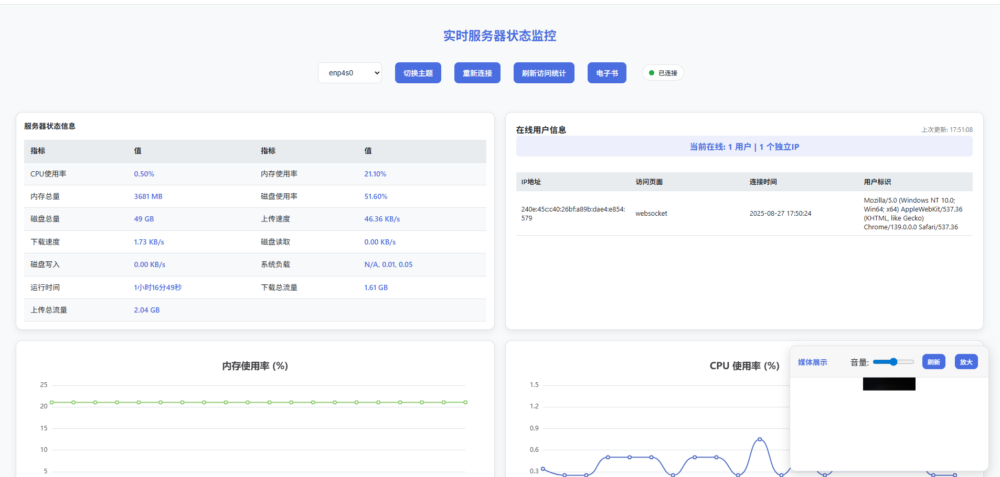
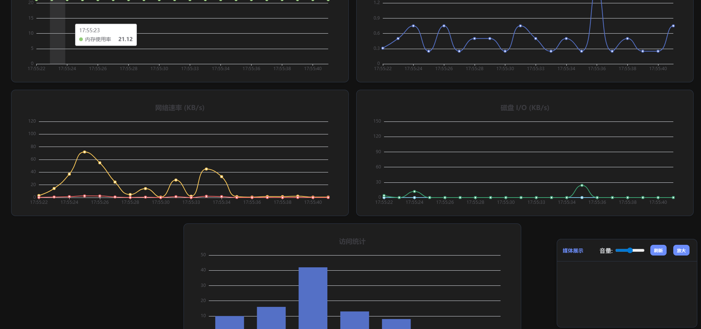
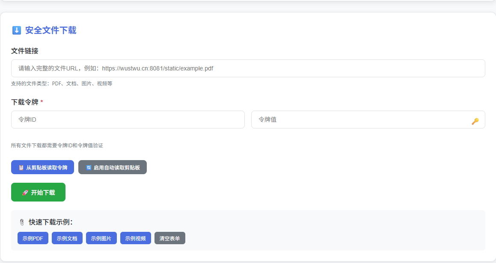

# 服务器监控与媒体服务系统

这是一个基于Go语言开发的综合性服务器监控和媒体服务系统，提供实时服务器状态监控、媒体文件服务和系统管理功能。

## 功能特性

- 🖥️ **实时服务器监控**：CPU、内存、磁盘、网络使用情况监控
- 📊 **WebSocket实时数据推送**：实时更新服务器状态信息
- 👥 **在线用户管理**：记录和显示当前在线用户信息
- 📈 **访问统计**：每日/每周访问量统计和唯一访客记录
- 🎥 **媒体文件服务**：随机图片和视频展示功能
- 📚 **EPUB电子书服务**：电子书文件列表和访问
- 🔧 **系统命令执行**：安全的系统命令执行接口
- 🔒 **安全认证**：Token-based身份验证机制
- 📱 **响应式设计**：适配不同设备的网页界面

## 安装与部署

### 前提条件

- Go 1.16 或更高版本
- SSL证书文件（用于HTTPS服务）
- 系统监控工具依赖：`gopsutil` 库

### 安装步骤

1. 克隆或下载项目代码
2. 安装依赖：
   ```bash
   go mod download
   ```
3. 准备SSL证书文件，放置于指定路径（默认为`/root/ssl/`）
4. 配置静态文件目录（默认为`/root/file/static/`）
5. 修改模板文件路径（默认为`/root/os/templates/`）

### 运行程序

```bash
go run main.go
```

或编译后运行：

```bash
go build -o server-monitor
./server-monitor
```

## 配置说明

### 关键配置参数

- `authToken`: API访问令牌（默认："123456"）
- `mediaDir`: 媒体文件目录（默认："/root/file/static"）
- 监听端口：9000（HTTPS）
- 数据持久化文件：`server_data.json`

### 证书配置

程序需要SSL证书文件，默认路径：

- 证书：`/root/ssl/wustwu.cn.pem`
- 私钥：`/root/ssl/wustwu.cn.key`

## API接口说明

### WebSocket监控接口

```
/ws?token=<token>&iface=<网络接口>
```

提供实时服务器状态数据推送，需要认证令牌和指定网络接口。

### 媒体服务接口

- `GET /random-media` - 获取随机媒体文件（图片/视频）
- `GET /video` - 视频播放页面
- `GET /epubs` - 获取EPUB电子书列表

### 系统状态接口

- `GET /status-ifaces` - 获取可用网络接口列表
- `GET /access-stats` - 获取访问统计信息

### 命令执行接口

```
POST /exec?token=<token>&command=<命令名>
```

支持的安全命令：`uptime`, `df`, `free`, `who`, `uname`, `ls`

## 数据结构

### 服务器状态(ServerStatus)

```go
type ServerStatus struct {
CPUUsage      float64 // CPU使用率
MemoryUsage   float64 // 内存使用率
MemoryTotal   uint64  // 总内存(MB)
DiskUsage     float64 // 磁盘使用率
DiskTotal     uint64  // 总磁盘空间(GB)
UploadSpeed   float64 // 上传速度(KB/s)
DownloadSpeed float64         // 下载速度(KB/s)
TotalUpload   string          // 总上传量
TotalDownload string          // 总下载量
ReadSpeed     float64         // 磁盘读取速度(KB/s)
WriteSpeed    float64 // 磁盘写入速度(KB/s)
Load1         float64 // 1分钟负载
Load5         float64 // 5分钟负载
Load15        float64 // 15分钟负载
Uptime        string  // 运行时间
OnlineCount   int     // 在线用户数
UniqueIPs     []string         // 唯一IP列表
OnlineUsers   []OnlineUserInfo // 在线用户详情
Hostname      string  // 主机名
OS            string  //操作系统名称
Platform      string  //平台名称
KernelVersion string  //内核版本
Architecture  string  //系统架构
}
```

## 数据持久化

程序会自动将统计数据保存到`server_data.json`文件中，包括：

- 总上传/下载流量累计值
- 每日/每周访问统计
- 程序重启后会自动加载历史数据

## 安全特性

- Token-based API认证
- CORS跨域支持配置
- 安全的命令执行白名单机制
- WebSocket连接心跳检测和超时管理
- 自动清理长时间无活动的在线用户

## 注意事项

1. 需要确保监控的网络接口名称正确
2. SSL证书路径需要根据实际部署调整
3. 媒体文件目录需要包含支持的媒体类型（.jpg, .png, .jpeg, .mp4, .webm）
4. 程序需要足够的权限读取系统监控信息
5. 生产环境建议修改默认的认证令牌

## 依赖库

- [gorilla/websocket](https://github.com/gorilla/websocket) - WebSocket支持
- [shirou/gopsutil](https://github.com/shirou/gopsutil) - 系统监控信息获取

## 许可证

本项目采用MIT许可证，详情请参阅LICENSE文件。

## 效果图

<table border="1" cellpadding="1" cellspacing="1" style="width: 500px">
    <tbody>
        <tr>
            <td></td>
            <td></td> 
        </tr>
        <tr>
            <td></td>
           <td></td>
        </tr>
    </tbody>
</table>
---

