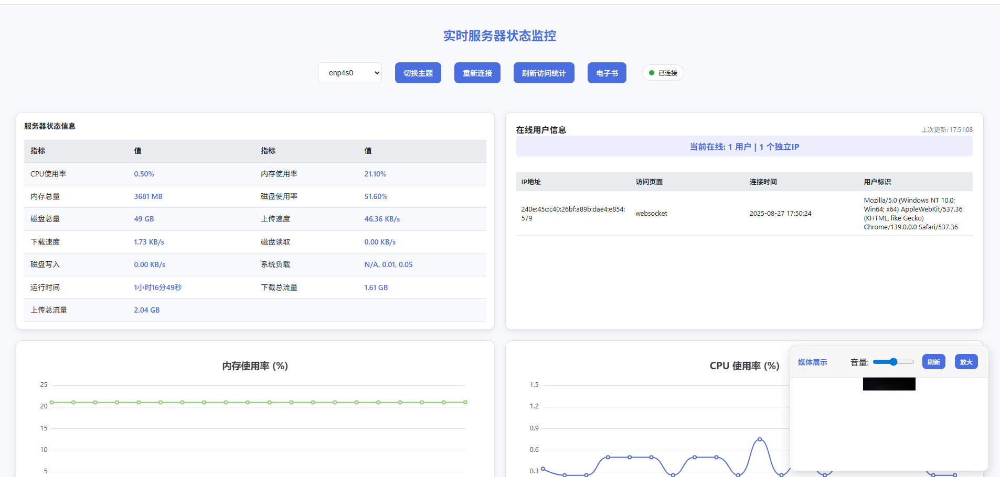
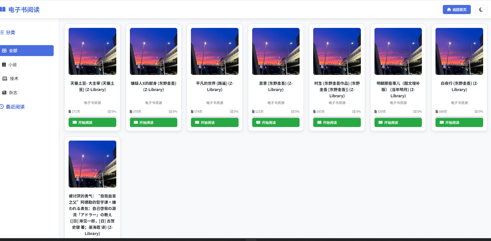
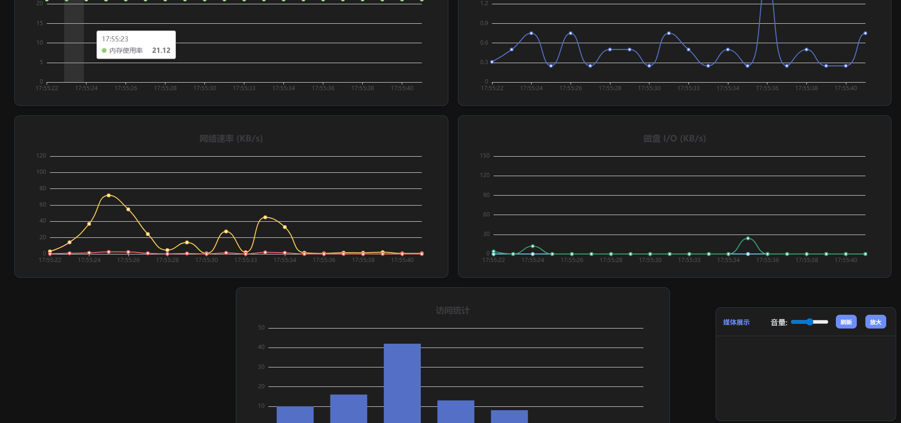
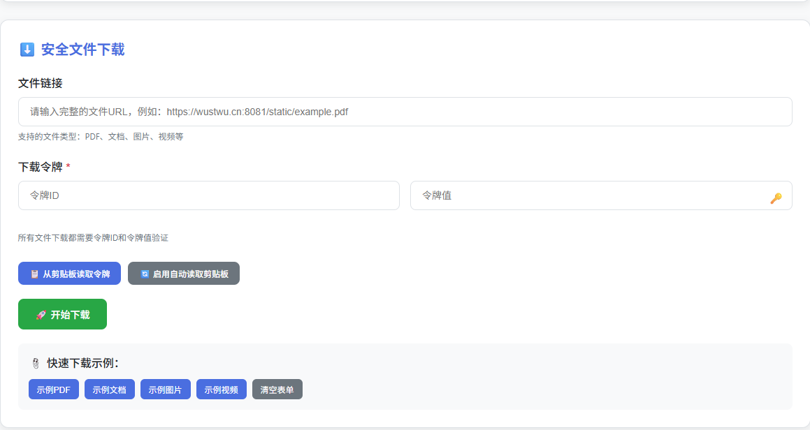

# 服务器监控与媒体服务系统

这是一个基于 Go 语言开发的综合性服务器监控和媒体服务系统，提供实时服务器状态监控、媒体文件服务、授权下载和系统管理功能。

## 功能特性

- 🖥️ **实时服务器监控**：CPU、内存、磁盘、网络实时监控，WebSocket 每秒推送
- 👥 **在线用户管理**：记录并展示当前在线用户信息
- 📈 **访问统计与 IP 流量**：每日/每周访问量、唯一访客、IP 明细与封禁管理
- 🎥 **媒体文件服务**：随机图片/视频展示、EPUB 电子书在线阅读
- 📁 **文件管理**：浏览、上传、新建目录、删除（含移动端卡片视图）
- ⚙️ **进程监控**：实时进程列表、CPU/内存 TOP10、结束进程
- 🔑 **授权下载**：令牌签发/撤销，支持粘贴下载链接自动解析令牌，配额与有效期控制
- 🛡️ **RBAC 权限管理**：用户/角色/权限管理，细粒度访问控制
- 🔒 **安全加固**：HMAC 签名、bcrypt 密码、登录防爆破、TLS 1.2+、CORS 白名单、XSS 转义、路径穿越防护
- 📱 **响应式设计**：桌面/移动端自适应，暗黑模式

## 安装与部署

### 前提条件

- Go 1.22 或更高版本（路由使用 `{role_id}` 通配符语法）
- SSL 证书文件（用于 HTTPS 服务）
- 系统监控工具依赖：`gopsutil` 库

### 安装步骤

1. 克隆或下载项目代码
2. 安装依赖：
   ```bash
   go mod download
   ```
3. 准备 SSL 证书文件，放置于指定路径（默认为 `/home/ssl/`）
4. 配置静态/媒体文件目录（默认为 `/home/file/static/`）
5. 模板文件目录（默认为 `/home/os/templates/`），可修改 `main.go` 中的常量

### 运行程序

```bash
go run main.go
```

或编译后运行：

```bash
go build -o server-monitor
./server-monitor
```

生产环境建议使用 systemd 管理（`server-status.service`），可用 `restart-server.sh` 编译并重启。

## 配置说明

### 关键配置参数

- `mediaDir`: 媒体文件目录（默认：`/home/file/static`）
- `indexPath`: 模板目录（默认：`/home/os/templates`）
- 监听端口：9000（HTTPS，TLS 1.2+）
- 数据持久化：`server_data.json`、`users.json`、`rbac.json`、`download_tokens.json`（AES-GCM 加密落盘）

### 证书配置

程序需要 SSL 证书文件，默认路径：

- 证书：`/home/ssl/xyx.homes.pem`
- 私钥：`/home/ssl/xyx.homes.key`

## API 接口说明

所有 `/api/` 接口均需登录会话；关键接口额外要求 HMAC-SHA256 签名头（`X-Timestamp`、`X-Nonce`、`X-Signature`）。

### WebSocket 监控接口

```
/ws?iface=<网络接口>
```

提供实时服务器状态数据推送，需要登录和 `system:view` 权限。

### 媒体服务接口

- `GET /random-media` - 获取随机媒体文件（图片/视频）
- `GET /video` - 视频播放页面
- `GET /epubs` - 获取 EPUB 电子书列表

### 文件管理与进程监控接口

- `GET /api/files` - 浏览文件（需 `files:manage`）
- `POST /api/files/upload` - 上传文件（禁止上传可执行/脚本/网页类文件）
- `POST /api/files/mkdir` - 新建目录
- `DELETE /api/files?path=...` - 删除文件/空目录
- `GET /api/processes` - 进程列表（需 `system:process`）
- `POST /api/processes/kill` - 结束进程

### IP 管理接口

- `GET /api/ip/blocked` - 封禁列表
- `POST /api/ip/block` - 封禁 IP
- `POST /api/ip/unblock` - 解封 IP
- `GET /api/ipinfo?ip=...` - IP 信息查询（仅透传经过校验的 IP 参数）

### RBAC 权限管理接口

- `GET /api/rbac/permissions` - 获取全部权限定义（需 `role:manage`）
- `GET /api/rbac/roles` - 获取角色列表（需 `role:manage`/`user:manage`/`user:view`）
- `GET /api/rbac/roles/{role_id}` - 获取单个角色（含权限）
- `POST /api/rbac/roles` - 创建角色（需 `role:manage`）
- `PUT /api/rbac/roles/{role_id}` - 更新角色（权限字段兼容数组或逗号字符串）
- `DELETE /api/rbac/roles/{role_id}` - 删除角色（内置角色不可删）
- `GET /api/rbac/users` - 获取用户列表
- `POST /api/rbac/users` - 创建用户
- `PUT /api/rbac/users/{username}` - 更新用户角色/邮箱/状态/密码
- `DELETE /api/rbac/users/{username}` - 删除用户

管理页面：`/rbac.html`

### 默认角色

- `admin`（超级管理员）：拥有全部权限（`*`）
- `operator`（运维人员）：`system:view`、`system:exec`、`files:view`、`files:download`、`token:manage`、`user:view`
- `user`（普通用户）：`system:view`、`files:view`、`files:download`、`token:manage`

权限定义：

| 权限 | 说明 |
| ---- | ---- |
| `system:view` | 查看服务器状态、访问统计 |
| `system:exec` | 执行系统命令 |
| `system:process` | 查看/结束进程 |
| `ip:manage` | 查看、封禁/解封 IP |
| `files:view` | 查看视频、电子书等媒体内容 |
| `files:download` | 下载文件 |
| `files:manage` | 浏览、上传、删除服务器文件 |
| `token:manage` | 管理下载令牌（查看/撤销自己名下的令牌） |
| `token:issue` | 为指定用户签发下载令牌 |
| `user:view` | 查看用户列表 |
| `user:manage` | 创建、编辑、禁用、删除用户 |
| `role:manage` | 创建、编辑、删除角色及权限 |

### 文件下载

`GET /download?token_id=...&token=...&file=...` 在校验令牌的同时校验令牌所属账号是否仍拥有 `files:download` 权限；权限被收回后，已发放的令牌立即失效。下载页支持粘贴完整下载链接自动解析令牌 ID 和令牌值。

### 命令执行接口

```
POST /exec?command=<命令名>
```

支持的安全命令（白名单 + 固定参数）：`uptime`、`df`、`free`、`who`、`uname`、`ls`

## 数据持久化

程序自动将统计数据与配置保存到 `/home/os` 下，包括：

- `server_data.json`：流量累计与访问统计
- `users.json`：用户与会话（AES-GCM 加密）
- `rbac.json`：角色权限（AES-GCM 加密）
- `download_tokens.json`：下载令牌（AES-GCM 加密）

程序重启后会自动加载历史数据。

## 安全特性

- 登录：bcrypt 密码哈希，登录/注册失败次数过多自动锁定（防暴力破解）
- 会话：HttpOnly + Secure + SameSite Cookie，服务端会话管理
- 请求签名：HMAC-SHA256 防篡改/防重放（关键接口）
- 反爬：浏览器 UA 白名单、行为分析、IP 封禁（不信任可伪造的 X-Forwarded-For）
- 命令执行：白名单命令 + 固定参数，禁止 shell 拼接
- 路径安全：目录穿越防护（路径规范化 + 目录边界校验）
- 上传安全：限制大小、禁止可执行/脚本/网页类扩展名
- 存储安全：用户/角色/令牌数据 AES-GCM 加密落盘
- 传输安全：TLS 1.2+，HSTS，X-Frame-Options，nosniff，Referrer-Policy
- 跨域：Origin 精确白名单校验（WebSocket + CORS）
- XSS：React 默认转义，旧版页面已做 HTML 转义并移除 onclick 注入
- 静态文件：模板目录中 `.bak/.json/.go/.key/.pem` 等敏感文件禁止访问

## 注意事项

1. 需要确保监控的网络接口名称正确
2. SSL 证书路径需要根据实际部署调整
3. 媒体文件目录需要包含支持的媒体类型（.jpg, .png, .jpeg, .mp4, .webm）
4. 程序需要足够的权限读取系统监控信息
5. 生产环境建议修改默认的安全令牌

## 依赖库

- [gorilla/websocket](https://github.com/gorilla/websocket) - WebSocket 支持
- [shirou/gopsutil](https://github.com/shirou/gopsutil) - 系统监控信息获取
- [golang.org/x/crypto](https://golang.org/x/crypto) - bcrypt 密码哈希

## 许可证

本项目采用 MIT 许可证，详情请参阅 LICENSE 文件。

## 效果图

<table border="1" cellpadding="1" cellspacing="1" style="width: 500px">
    <tbody>
        <tr>
            <td></td>
            <td></td>
        </tr>
        <tr>
            <td></td>
            <td></td>
        </tr>
    </tbody>
</table>

> 说明：截图可能滞后于最新界面；最新版本还包含文件管理、进程监控、IP 流量、权限管理、安全下载等管理页面。
---
