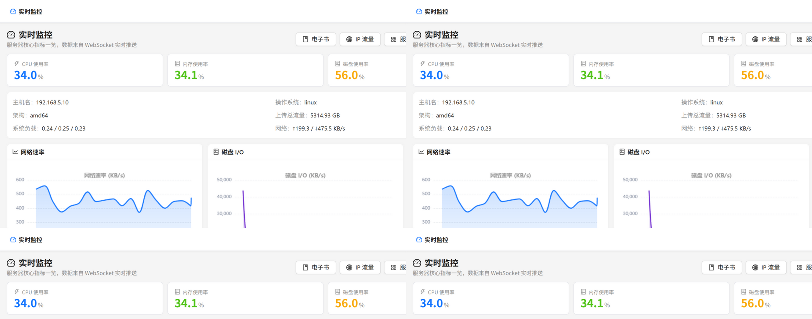
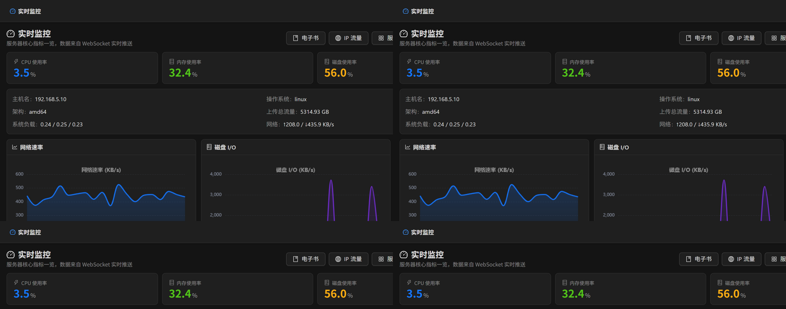
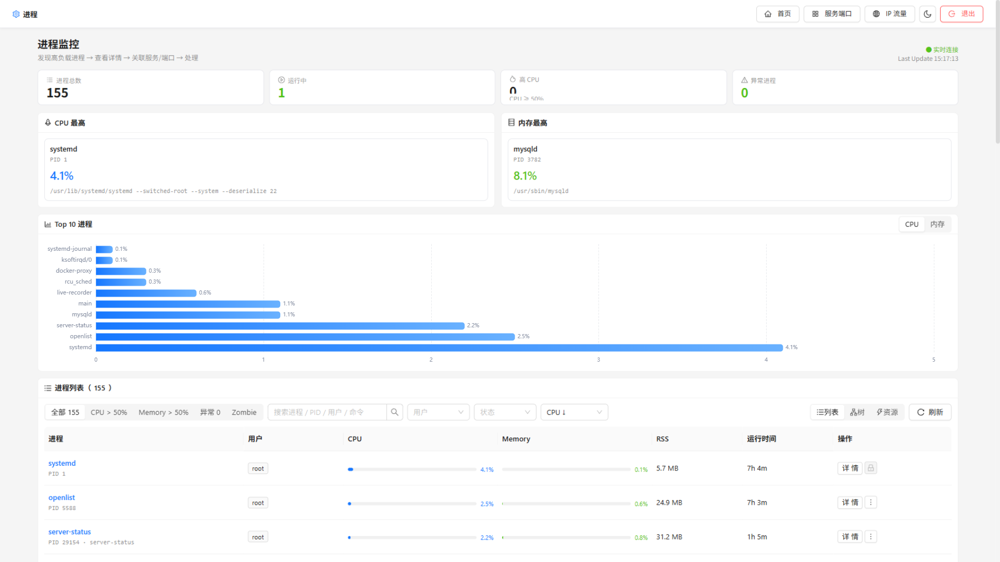
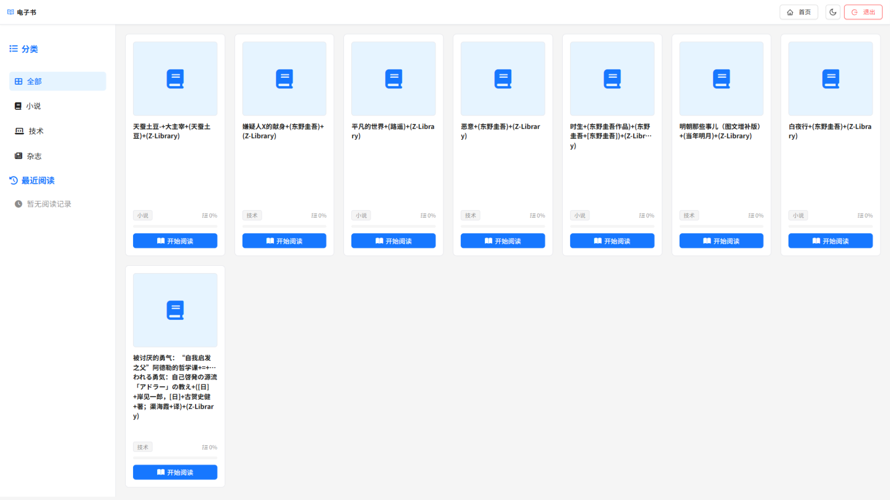
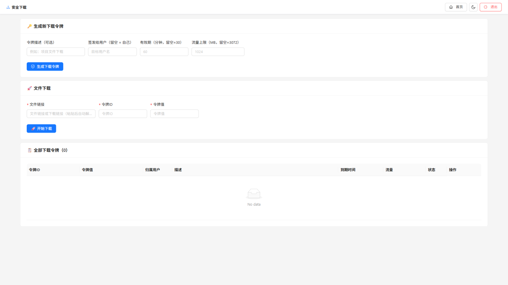
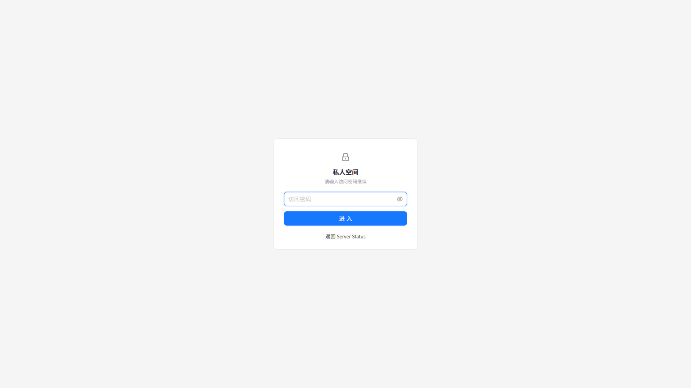
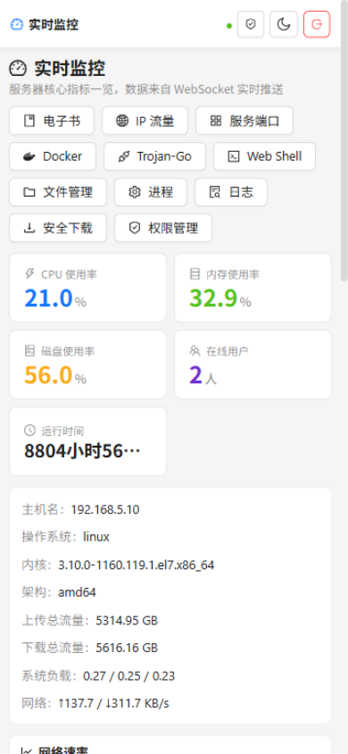

# 服务器监控与媒体服务系统

这是一个基于 Go 语言开发的综合性服务器监控和媒体服务系统，提供实时服务器状态监控、媒体文件服务、授权下载和系统管理功能。

## 功能特性

- 🖥️ **实时服务器监控**：CPU、内存、磁盘、网络实时监控，WebSocket 每秒推送
- 👥 **在线用户管理**：记录并展示当前在线用户信息
- 📈 **访问统计与 IP 流量**：每日/每周访问量、唯一访客、IP 明细与封禁管理
- 🎥 **媒体文件服务**：随机图片/视频展示、EPUB 电子书在线阅读
- 📁 **文件管理**：浏览、上传、新建目录、删除（含移动端卡片视图）
- ⚙️ **进程监控**：实时进程列表、CPU/内存 TOP10、结束进程
- 🧰 **服务与端口中心**：systemd 服务创建/启停/自启/实时日志、监听端口识别与分类、防火墙开放/关闭与端口规则
- 🖥️ **Web Shell（Web 终端）**：真正的 Linux PTY 交互终端（xterm.js + WebSocket），每次启动均需独立 Shell 二次认证 + 一次性 Token，`system:exec` 权限
- 🚀 **Trojan-Go 监控与管理**：状态/在线用户/IP/实时流量图表，用户增删改、限速与 IP 限制（gRPC → 后端 → WebSocket）；用户档案本地持久化，Trojan-Go/面板重启后自动补发缺失用户
- 🔑 **授权下载**：令牌签发/撤销，支持粘贴下载链接自动解析令牌，配额与有效期控制
- 🛡️ **RBAC 权限管理**：用户/角色/权限管理，细粒度访问控制
- 🔒 **隐藏私人空间**：普通界面完全不可见，仅通过隐藏入口进入；私人手记 + 图片 + 定位 + 语音 + 信息卡片生成与分享
- 🔒 **安全加固**：HMAC 签名、bcrypt 密码、登录防爆破、TLS 1.2+、CORS 白名单、XSS 转义、路径穿越防护
- 📱 **响应式设计**：桌面/移动端自适应，暗黑模式

## 🔒 隐藏私人空间（Private Notes）

> 这是我服务器里隐藏的一个私人数字空间，可以记录生活，也可以把记录变成可以带走的图片卡片。

### 入口（普通 UI 完全看不到）

- 桌面端：`Ctrl + Shift + Alt + N` 打开密码验证
- 移动端：连续快速点击 Server Status Logo 5 次
- 主菜单、顶部导航、Dashboard 均不显示任何入口与提示

### 首次启用

1. 部署 `private_notes.json`（默认已启用），私人密码只保存 bcrypt Hash，**不会写入任何 JSON / JS / HTML / localStorage**。
2. 首次启动时设置私人空间密码（二选一）：
   - 环境变量：`PRIVATE_NOTES_PASSWORD=你的密码 ./server-status`（仅首次启动且未设置密码时生效）
   - 管理员接口：登录后调用
     ```bash
     CSRF=$(grep csrf_token <登录Cookie文件> | awk '{print $7}')
     curl -k -X POST https://your-host:9000/api/private/setup-password \
       -H "Content-Type: application/json" -b "session_id=<登录Cookie>" \
       -H "X-CSRF-Token: $CSRF" \
       -d '{"password":"你的密码"}'
     ```
     （写操作需会话 + CSRF Token，与前端其他 API 相同）

### 双层认证与安全模型

- 第一层：Server Status 普通登录；第二层：私人空间密码。
- `private session` 默认 30 分钟无操作自动锁定；右上角可手动锁定，立即删除服务端 session。
- 密码错误 5 次 → 锁定 60 秒，且不会暴露“密码是否正确/用户是否存在/功能是否存在”。
- 私人 API 缺少普通登录返回 401，缺少私人解锁返回 403。
- 图片/语音只保存在私有目录 `data/notes/YYYY/MM/DD/`，必须经过双层认证的 API 访问；
  静态文件服务不会暴露该目录。数据库 `private_notes.db` 只存 `file_path`，不存二进制。
- 分享 Token 为 32 字节随机数，数据库只保存 Hash；分享密码使用 bcrypt；过期/撤销由服务端强制判断。
- 审计日志记录解锁/锁定/创建/删除/卡片/分享/撤销动作，**绝不记录正文、图片内容、密码或 Hash**。

### 功能

- 时间线（按天分组，卡片式手记，支持 Markdown / 代码块 / Checklist）
- 新建/编辑手记：标题（可空）、正文、多图（点击/拖拽/拍照/相册/排序/删除/预览）、定位（浏览器定位或手动选择地点）、标签、语音录音、手动修改时间、`Ctrl + Enter` 快速保存
- 标签页、全局搜索（标题/正文/标签/地点）、Markdown 导出
- 卡片生成器：简洁 / 深色 / 图片 / 旅行 / 服务器状态 5 种模板；1080×1080 / 1080×1350 / 1170×2532；
  Canvas 渲染真实 PNG，支持保存图片、复制到剪贴板、分享链接 + 二维码 + 访问密码 + 有效期 + 允许下载开关
- 卡片历史：预览、再次保存、创建分享、撤销分享、删除
- Light / Dark 自动跟随系统主题（与 Server Status 一致）

### 配置（private_notes.json）

```json
{
  "private_notes": {
    "enabled": true,
    "unlock_timeout": "30m",
    "max_login_attempts": 5,
    "lockout_duration": "1m",
    "storage_dir": "./data/notes"
  },
  "cards": {
    "enabled": true,
    "default_width": 1080,
    "default_height": 1080
  }
}
```

### 部署到服务器

完整部署步骤与**必配清单**（证书 / 密钥 / 默认账号 / 路径）统一见下方 [部署指南](#部署指南必配清单密钥--证书--路径--端口)。

与私人空间直接相关的只有一条：首次启动前在 systemd 中设置 `PRIVATE_NOTES_PASSWORD` 完成密码初始化（**仅首次启动生效**，之后可从 systemd 中移除）。

注意：`private_notes.db` 等数据文件由程序自动创建，请确保运行用户对 `/opt/server-status` 有写权限。
分享页面 `/card/<token>` 无需登录；设置密码的分享必须验证密码后才能查看图片。

## 部署指南（必配清单：密钥 / 证书 / 路径 / 端口）

以下是全新部署时**必须自己设置**的全部配置项。它们大多不是通用默认值：有的写死在源码里（改了要重新编译），有的是首次启动一次性读取的变量，有的是自动生成的默认账号密码。逐项核对后再上线。

### 1. TLS 证书与域名（编译期常量，改配置无效）

| 配置项 | 当前硬编码值 | 代码位置 |
|---|---|---|
| 证书文件 | `/etc/server-status/tls/example.com.pem` | `main.go` 常量 `tlsCertFile` |
| 证书私钥 | `/etc/server-status/tls/example.com.key` | `main.go` 常量 `tlsKeyFile` |
| 证书域名（SNI） | `example.com` | `main.go` 常量 `tlsDomain` |
| 监听地址 | `:9000`（HTTPS，TLS 1.2+，端口固定） | `main.go` 启动处 `http.Server{Addr: ":9000"}` |
| 来源白名单（CORS/WebSocket） | `https://example.com:9000` 等 | `main.go` Origin 白名单列表 |
| 媒体外链基地址 | `https://example.com:8081/static/` | `main.go` 常量 `urls` |

要点：

- 证书路径、域名、端口都**没有运行时配置入口**，与你的实际环境不符时，必须修改 `main.go` 对应常量后重新编译。
- 证书必须与访问域名匹配（Let's Encrypt 示例：`sudo certbot certonly --standalone -d 你的域名`，把 `fullchain.pem` / `privkey.pem` 放到上面两个路径）。自签或域名不匹配的证书在手机浏览器上会导致部分 Web API 被禁用（如 GPS 定位要求安全上下文）。
- 防火墙 / 反向代理放行 9000 端口即可。

### 2. 服务端密钥（环境变量注入，三个都必须设）

| 环境变量 | 保护什么 | 不设置的后果 |
|---|---|---|
| `SERVER_STATUS_SIGNING_KEY` | HMAC 签名：私人空间入口 Cookie、分享密码 Cookie、下载令牌 | 每次启动随机生成，**重启后所有已签发 Cookie / 令牌全部失效**（日志打 ⚠️） |
| `SERVER_STATUS_ENCRYPT_KEY` | AES-GCM 落盘加密：私人手记数据、Shell 密码文件 | 退回内置默认密钥，等于**数据可被任何拿到源码的人解密**（日志打 ⚠️） |
| `SERVER_STATUS_DOWNLOAD_TOKEN_SECRET` | 下载令牌签名 | 同上 |

```bash
# 三个密钥各自生成、互不相同；生成后保持不变——
# 更换 ENCRYPT_KEY 会导致已加密数据无法解密，更换 SIGNING_KEY 等效于全员登出
openssl rand -hex 32
```

### 3. 首次启动的账号与密码（一次性）

- **默认管理员 `admin / admin123`**：`/opt/server-status/users.json` 不存在时自动创建（日志打印 `创建默认管理员用户`）。**首次登录后立刻修改密码**，并按需配置 RBAC 角色。
- `PRIVATE_NOTES_PASSWORD`：私人空间密码。**仅首次启动**时读取并以 bcrypt 写入数据库，之后该变量不再生效（可从 systemd 移除）；已初始化过再改这个变量没有用，改密请在应用内操作。
- `SHELL_PASSWORD_HASH`（可选）：Web Shell 二次认证密码的 bcrypt 哈希。设置后密码由环境变量管理，页面上的改密接口会被禁用；取消设置后回退到加密文件 `shell_pw.dat`。

```bash
# 生成 bcrypt 哈希（htpasswd 来自 apache2-utils / httpd-tools）
htpasswd -bnBC 10 "" '你的密码' | tr -d ':\n'
```

### 4. systemd 环境变量注入

推荐用独立 env 文件（`/etc/server-status/server-status.env`，属主 root、权限 0600），在 `server-status.service` 中挂载：

```ini
[Service]
EnvironmentFile=/etc/server-status/server-status.env
```

```bash
# /etc/server-status/server-status.env 内容示例
SERVER_STATUS_SIGNING_KEY=<openssl rand -hex 32 生成>
SERVER_STATUS_ENCRYPT_KEY=<另一个随机值>
SERVER_STATUS_DOWNLOAD_TOKEN_SECRET=<另一个随机值>
# PRIVATE_NOTES_PASSWORD=首次初始化私人空间密码用，生效后删除此行
# SHELL_PASSWORD_HASH=$2y$10$...（可选）
```

改完执行 `systemctl daemon-reload && systemctl restart server-status`。启动后用 `journalctl -u server-status -n 20` 确认没有密钥相关 ⚠️ 告警。

### 5. 目录与数据文件（自动创建，路径为编译期常量）

| 路径 | 说明 |
|---|---|
| `/opt/server-status/templates/` | 前端模板，**必须随版本部署**（含 `private.html` / `share.html` 等），缺失对应页面 500；服务端每次请求直接读磁盘，只更新模板无需重启 |
| `/opt/server-status/server_data.json`、`users.json`、`rbac.json`、`download_tokens.json`、`trojan_credentials.json` | 运行数据，自动创建（敏感数据加密落盘 / 0600） |
| `/opt/server-status/private_notes.db`（含 `-wal` / `-shm`） | 私人空间 SQLite 数据库 |
| `/opt/server-status/private_notes.json` | 私人空间功能配置 |
| `/opt/server-status/media/` | 媒体文件目录，需预先存在并放入媒体文件 |
| `/opt/server-status/log/` | 日志目录 |
| `/opt/server-status/config.json` | Trojan-Go 监控配置（见第 7 节） |

以上路径写死在 `main.go` 顶部常量区（`indexPath` / `mediaDir` / `dataFile` / `usersFile` / `downloadTokensFile` 等），需要调整就改常量重新编译。开发调试时可用环境变量 `SERVER_STATUS_HOME` 整体覆盖私人空间数据根目录与日志目录（默认 `/opt/server-status`）。

### 6. 环境变量速查

| 环境变量 | 作用 | 默认行为 |
|---|---|---|
| `SERVER_STATUS_SIGNING_KEY` / `SERVER_STATUS_ENCRYPT_KEY` / `SERVER_STATUS_DOWNLOAD_TOKEN_SECRET` | 见第 2 节，**生产必设** | 随机生成 / 内置默认值 |
| `PRIVATE_NOTES_PASSWORD` | 私人空间密码初始化（仅首次） | 不初始化则无法进入私人空间 |
| `SHELL_PASSWORD_HASH` | Web Shell 二次认证密码 | 未设置时用页面初始化 + 加密文件 |
| `SERVER_STATUS_HOME` | 私人空间数据根目录 + 日志目录覆盖（开发用） | `/opt/server-status` |
| `SERVER_STATUS_TROJAN_ENABLED` / `_API_ADDR` / `_API_TIMEOUT` / `_REFRESH_INTERVAL` | 覆盖 config.json 的 Trojan-Go 监控配置 | 读 config.json |
| `MAX_SHELLS_PER_USER` / `MAX_SHELLS_GLOBAL` / `SHELL_IDLE_TIMEOUT` / `SHELL_MAX_LIFETIME` / `SHELL_TOKEN_TTL` | Web Shell 并发与生命周期调优（可选） | 3 / 10 / 30m / 12h / 60s |

### 7. 可选组件

- **Trojan-Go 监控**：`/opt/server-status/config.json` 的 `trojan` 段按你的实际部署修改——示例值（`api_addr: 127.0.0.1:10000`、`connection.server/port/sni: example.com/8388`、`websocket.path: /ws`、`lan_cidr: 192.168.1.0/24`）都是**本机环境的值，非通用默认**。详见 [TROJAN.md](TROJAN.md)：用户档案持久化在 `trojan_credentials.json`（0600），Trojan-Go 重启后面板按档案自动补发用户。
- **ipinfo 代理**：`/api/ipinfo` 固定反代到 `https://127.0.0.1:8081/ipinfo`。本机 8081 没有该服务时仅此功能不可用，其余不受影响。

### 8. 标准部署流程（Linux）

```bash
# 1. 本地构建 Linux 产物（在项目根目录）
CGO_ENABLED=0 GOOS=linux GOARCH=amd64 go build -ldflags="-s -w" -o server-status .

# 2. 上传（二进制 + 模板；模板改动可单独上传、即时生效）
scp -O server-status root@服务器:/opt/server-status/server-status.new
ssh root@服务器 "mv /opt/server-status/server-status.new /opt/server-status/server-status && chmod +x /opt/server-status/server-status"
scp -O -r templates root@服务器:/opt/server-status/

# 3. 首次部署：证书放 /etc/server-status/tls/、密钥写入 env 文件（见第 1/2/4 节）

# 4. 重启并验证
sudo systemctl restart server-status
journalctl -u server-status -n 20 --no-pager
curl -sk -o /dev/null -w '%{http_code}\n' https://127.0.0.1:9000/
```

> 直接 `scp` 覆盖正在运行的二进制会报 `Text file busy`，按上面先传 `.new` 再 `mv` 原子替换。

### 本地开发运行

```bash
go mod download
SERVER_STATUS_HOME=./data go run main.go   # 数据/日志写入 ./data（仍需 /etc/server-status/tls 证书，可改常量后运行）
```

生产环境建议使用 systemd 管理（`server-status.service`），可用 `restart-server.sh` 在服务器上编译并重启。

## API 接口说明

所有 `/api/` 接口均需登录会话（HttpOnly + Secure + SameSite Cookie）；写操作（POST/PUT/PATCH/DELETE）额外要求 CSRF Token（请求头 `X-CSRF-Token` 来自登录会话绑定的非 HttpOnly `csrf_token` Cookie，Double-Submit 模式）。
> 说明：已彻底移除浏览器端 HMAC 签名（`X-Timestamp`/`X-Nonce`/`X-Signature`），浏览器不再持有任何服务端 Secret。

### WebSocket 监控接口

```
/ws?iface=<网络接口>
```

提供实时服务器状态数据推送，需要登录和 `system:view` 权限。

### 媒体服务接口

- `GET /random-media` - 获取随机媒体文件（图片/视频）
- `GET /video` - 视频播放页面
- `GET /epubs` - 获取 EPUB 电子书列表

### 文件管理与进程监控接口

- `GET /api/files` - 浏览文件（需 `files:manage`）
- `POST /api/files/upload` - 上传文件（禁止上传可执行/脚本/网页类文件）
- `POST /api/files/mkdir` - 新建目录
- `DELETE /api/files?path=...` - 删除文件/空目录
- `GET /api/processes` - 进程列表（需 `system:process`）
- `POST /api/processes/kill` - 结束进程

### IP 管理接口

- `GET /api/ip/blocked` - 封禁列表
- `POST /api/ip/block` - 封禁 IP
- `POST /api/ip/unblock` - 解封 IP
- `GET /api/ipinfo?ip=...` - IP 信息查询（仅透传经过校验的 IP 参数）

### RBAC 权限管理接口

- `GET /api/rbac/permissions` - 获取全部权限定义（需 `role:manage`）
- `GET /api/rbac/roles` - 获取角色列表（需 `role:manage`/`user:manage`/`user:view`）
- `GET /api/rbac/roles/{role_id}` - 获取单个角色（含权限）
- `POST /api/rbac/roles` - 创建角色（需 `role:manage`）
- `PUT /api/rbac/roles/{role_id}` - 更新角色（权限字段兼容数组或逗号字符串）
- `DELETE /api/rbac/roles/{role_id}` - 删除角色（内置角色不可删）
- `GET /api/rbac/users` - 获取用户列表
- `POST /api/rbac/users` - 创建用户
- `PUT /api/rbac/users/{username}` - 更新用户角色/邮箱/状态/密码
- `DELETE /api/rbac/users/{username}` - 删除用户

管理页面：`/rbac.html`

### 默认角色

- `admin`（超级管理员）：拥有全部权限（`*`）
- `operator`（运维人员）：`system:view`、`system:exec`、`files:view`、`files:download`、`token:manage`、`user:view`
- `user`（普通用户）：`system:view`、`files:view`、`files:download`、`token:manage`

权限定义：

| 权限 | 说明 |
| ---- | ---- |
| `system:view` | 查看服务器状态、访问统计 |
| `system:exec` | 执行系统命令 |
| `system:process` | 查看/结束进程 |
| `ip:manage` | 查看、封禁/解封 IP |
| `files:view` | 查看视频、电子书等媒体内容 |
| `files:download` | 下载文件 |
| `files:manage` | 浏览、上传、删除服务器文件 |
| `token:manage` | 管理下载令牌（查看/撤销自己名下的令牌） |
| `token:issue` | 为指定用户签发下载令牌 |
| `user:view` | 查看用户列表 |
| `user:manage` | 创建、编辑、禁用、删除用户 |
| `role:manage` | 创建、编辑、删除角色及权限 |

### 文件下载

`GET /download?token_id=...&token=...&file=...` 在校验令牌的同时校验令牌所属账号是否仍拥有 `files:download` 权限；权限被收回后，已发放的令牌立即失效。下载页支持粘贴完整下载链接自动解析令牌 ID 和令牌值。

### 命令执行接口

```
POST /exec?command=<命令名>
```

支持的安全命令（白名单 + 固定参数）：`uptime`、`df`、`free`、`who`、`uname`、`ls`

## Web Shell（Web 终端）

真正的 Linux PTY 交互终端，适用于需要执行任意命令的运维场景。

### 使用流程

```
登录 Server Status → RBAC system:exec → 点击 Web Shell
→ 🔐 二次认证（输入独立 Shell 密码）→ 一次性 Token → WebSocket → PTY → 真正 Linux Shell
```

**每次新建 Shell 都必须重新输入 Shell 密码二次认证**（即使已登录、即使刚开过一个 Shell、即使拥有 `system:exec`）。浏览器不会保存密码或 Token。

### 关键机制

- **PTY**：`github.com/creack/pty` 创建真实交互 PTY，`$SHELL` → `/bin/bash` → `/bin/sh` 自动选择；支持 ANSI、颜色、光标、命令历史，以及 `top`/`htop`/`vim`/`nano`/`less`/`tail -f`/`journalctl -f`/`ping`/`systemctl` 等交互程序。
- **WebSocket**：`/ws/shell`，服务端输出用 Binary Frame，输入消息上限 64KB，输出走有界队列背压，防止输出洪水。
- **二次认证与一次性 Token**：Shell 密码 bcrypt 校验，成功后颁发 60 秒一次性 Token；服务端只存 `sha256(token)`，WebSocket 首帧 `auth` 消费后立即失效（防重放/防枚举）。
- **并发限制**：每用户 ≤3 个 Shell、全局 ≤10 个 Shell。
- **超时与清理**：空闲 30 分钟自动关闭；最长生命周期 12 小时；连接断开/`Ctrl+C`/`exit`/登出/管理端强制关闭时完整回收 PTY、进程树、FD、goroutine，不遗留孤儿进程。
- **安全边界**：
  - 复用 Server Status 登录 Session + RBAC `system:exec` + Origin 校验 + WebSocket 首帧认证，**先认证后建 PTY**；
  - Shell 密码只存 bcrypt Hash（环境变量 `SHELL_PASSWORD_HASH` 或加密文件），不进入日志/API/WS/HTML/JS/存储；
  - 防爆破：同用户/IP 连续失败 5 次锁定 60 秒，失败统一返回同一文案，不泄露任何信息；
  - Shell 环境剥离 `SERVER_STATUS_*` 敏感变量，绝不回传浏览器；
  - 审计仅记录会话生命周期（auth/session created/used/closed/timeout/killed 等），**绝不记录终端输入与输出**。
- **移动端**：底部快捷键栏（ESC / TAB / 方向键 / HOME / END / CTRL+C / CTRL+L / CTRL+Z / CTRL+D），自动 resize、防键盘顶坏、终端点击聚焦。

### Shell 密码初始化

管理员登录后调用（写操作需会话 + CSRF Token）：

```bash
curl -k -X POST https://your-host:9000/api/shell/setup-password \
  -H "Content-Type: application/json" -b "session_id=<登录Cookie>" \
  -H "X-CSRF-Token: <csrf_token>" \
  -d '{"password":"你的Shell密码"}'
```

也可以直接用环境变量注入 bcrypt Hash（此时视为环境管理，API 不可修改）：

```dotenv
SHELL_PASSWORD_HASH=$2a$10$...
```

### API

| 方法/路径 | 说明 |
|---|---|
| `GET /shell.html` | Web Shell 页面（需登录 + `system:exec`） |
| `POST /api/shell/auth` | 二次认证，返回一次性 `shell_token`（60s） |
| `POST /api/shell/setup-password` | 管理员初始化 Shell 密码 |
| `POST /api/shell/change-password` | 修改 Shell 密码（成功即撤销旧认证 + 关闭本人全部 Shell） |
| `GET /api/shell/sessions` | 列出运行中的 Shell |
| `DELETE /api/shell/sessions/{id}` | 关闭指定 Shell |
| `DELETE /api/shell/auth-sessions/{id}` | 撤销等待启动的认证 |
| `POST /api/shell/revoke-all` | 撤销全部待启动认证 |
| `GET /ws/shell` | WebSocket 终端（首帧 `{"type":"auth","token":...}`） |

### WebSocket 消息

```json
// 浏览器 → 服务端（注意：首帧必须是 auth）
{"type":"auth","token":"ONE_TIME_TOKEN","rows":40,"cols":120}
{"type":"input","data":"ls -lah\n"}
{"type":"resize","rows":40,"cols":120}
{"type":"ping"}
{"type":"close"}
// 服务端 → 浏览器
<Binary Frame: 终端输出>
{"type":"error","message":"..."}
{"type":"pong"}
```

> Web Shell 与 `POST /exec` 相互独立：`/exec` 用于安全固定命令白名单，Web Shell 才用于真正的交互式 Shell；实现并未放宽 `/exec` 白名单。

## 数据持久化

程序自动将统计数据与配置保存到 `/opt/server-status` 下，包括：

- `server_data.json`：流量累计与访问统计
- `users.json`：用户与会话（AES-GCM 加密）
- `rbac.json`：角色权限（AES-GCM 加密）
- `download_tokens.json`：下载令牌（AES-GCM 加密）
- `trojan_credentials.json`：Trojan 用户档案（hash + 明文密码 + 限速/IP 限额，权限 0600），用于 Trojan-Go 重启后自动恢复用户

程序重启后会自动加载历史数据。

## 安全特性

- 登录：bcrypt 密码哈希，登录/注册失败次数过多自动锁定（防暴力破解）
- 会话：HttpOnly + Secure + SameSite Cookie，服务端会话管理（浏览器不持有任何 HMAC Secret）
- CSRF：服务端 `crypto/rand` 生成的高强度随机 Token，写入非 HttpOnly Cookie（Double-Submit 模式），写操作（POST/PUT/PATCH/DELETE）强制校验
- 反爬：浏览器 UA 白名单、行为分析、IP 封禁（不信任可伪造的 X-Forwarded-For）
- 命令执行：白名单命令 + 固定参数，禁止 shell 拼接
- 路径安全：目录穿越防护（路径规范化 + 目录边界校验）
- 上传安全：限制大小、禁止可执行/脚本/网页类扩展名
- 存储安全：用户/角色/令牌数据 AES-GCM 加密落盘
- 传输安全：TLS 1.2+，HSTS，X-Frame-Options，nosniff，Referrer-Policy
- 跨域：Origin 精确白名单校验（WebSocket + CORS）
- XSS：React 默认转义，旧版页面已做 HTML 转义并移除 onclick 注入
- 静态文件：模板目录中 `.bak/.json/.go/.key/.pem` 等敏感文件禁止访问

## 注意事项

1. 需要确保监控的网络接口名称正确
2. SSL 证书路径 / 域名 / 端口为编译期常量，调整需修改 `main.go` 后重新编译（见「部署指南」第 1 节）
3. 媒体文件目录需要包含支持的媒体类型（.jpg, .png, .jpeg, .mp4, .webm）
4. 程序需要足够的权限读取系统监控信息
5. 生产环境必须通过环境变量注入服务端密钥（见「部署指南」第 2/4 节），替换内置默认值

## 环境变量（服务端密钥）

服务端密钥、密码初始化、Shell 限制、Trojan 覆盖等全部环境变量已统一收录在上方 [部署指南](#部署指南必配清单密钥--证书--路径--端口) 的第 2、3、6 节，请以该清单为准维护。

> 注意：内置默认密钥仅为保证旧部署可用；任何真实的部署都应通过环境变量提供随机高强度密钥。

## 压力测试

内置零依赖压测工具（纯标准库），支持未认证/认证两种场景、爬坡与限速：

```bash
# 认证场景：每个 worker 登录一次后压测只读接口（推荐，梯度和健康判据见下）
STRESS_PASSWORD='你的密码' go run ./stress -target https://192.168.1.10:9000 \
  -scenario auth -username admin -c 100 -d 30s -ramp 5s

# 未认证场景（公开路径）
go run ./stress -target https://192.168.1.10:9000 -scenario public -c 50 -d 30s
```

- 主要参数：`-c` 并发数、`-d` 时长、`-ramp` 爬坡（worker 逐个启动，高并发下可避免登录风暴）、`-rate` 总 QPS 上限；
- 报告输出 RPS、状态码分布、延迟分位（avg/p50/p90/p95/p99/max），健康判据为 **p99 < 500ms 且错误率 < 1%**，可按并发阶梯逐档定位最大健康并发；
- 压测只打只读 GET 接口，不产生写操作；已登录会话不受反爬频控，可安全进行高强度测试。**切勿用未认证（public）场景高强度压测**：单 IP 5 分钟内超过 100 次请求会触发自动封禁 1 小时；
- 请在局域网内或低峰期执行，压测对象应是自己有权限的服务。

## 依赖库

- [gorilla/websocket](https://github.com/gorilla/websocket) - WebSocket 支持
- [shirou/gopsutil](https://github.com/shirou/gopsutil) - 系统监控信息获取
- [golang.org/x/crypto](https://golang.org/x/crypto) - bcrypt 密码哈希
- [creack/pty](https://github.com/creack/pty) - 伪终端（Web Shell）

## 许可证

本项目采用 MIT 许可证，详情请参阅 LICENSE 文件。

## 效果图

<table border="1" cellpadding="1" cellspacing="1">
    <tbody>
        <tr>
            <td></td>
            <td></td>
        </tr>
        <tr>
            <td></td>
            <td></td>
        </tr>
        <tr>
            <td></td>
            <td></td>
        </tr>
        <tr>
            <td></td>
            <td></td>
        </tr>
        <tr>
            <td></td>
            <td></td>
        </tr>
        <tr>
            <td></td>
            <td></td>
        </tr>
        <tr>
            <td></td>
            <td></td>
        </tr>
        <tr>
            <td></td>
            <td></td>
        </tr>
        <tr>
            <td colspan="2"></td>
        </tr>
    </tbody>
</table>
---
